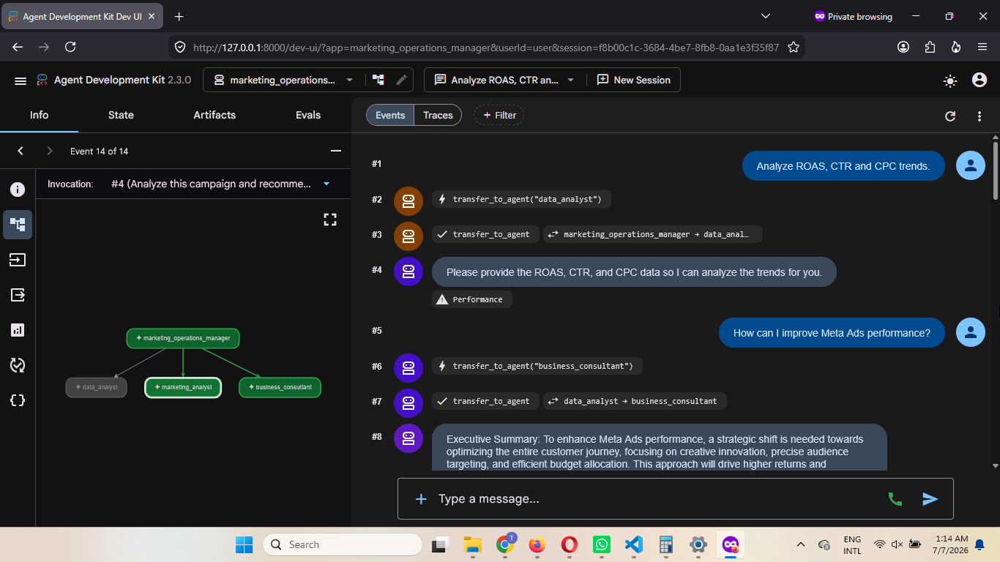
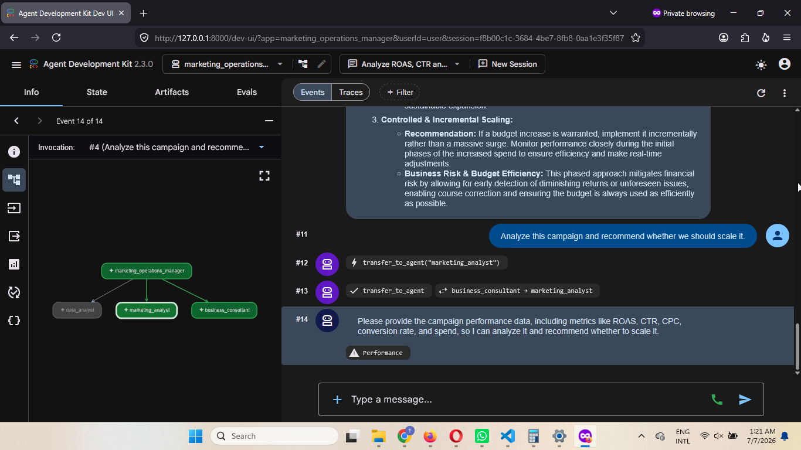
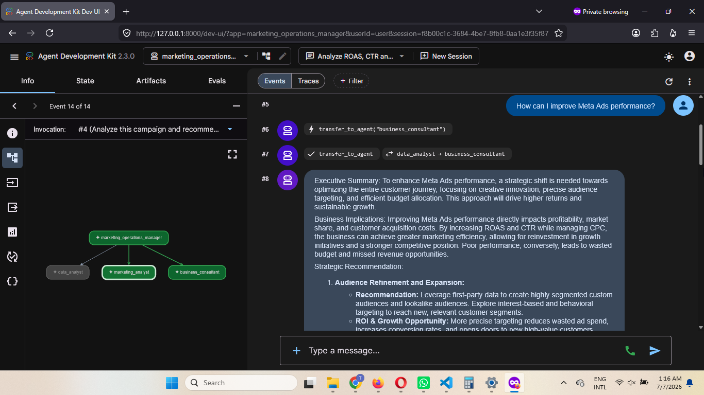

# 🚀 AI Marketing Operations Manager

A production-style Multi-Agent AI Marketing Assistant built with **Google Agent Development Kit (ADK) 2.3.0** and **Gemini 2.5 Flash**.

This project demonstrates how multiple AI specialists collaborate to analyze digital marketing performance and generate strategic business recommendations.

## Architecture


---

## Data Analyst Routing



---

## Marketing Analyst Routing



---

## Business Consultant Routing



---

## ✨ Features

- Multi-Agent Architecture
- Google ADK 2.3.0
- Gemini 2.5 Flash
- Intelligent Task Routing
- Marketing Performance Analysis
- Business Recommendation Engine
- Interactive ADK Web UI

---

## 🏗 Architecture

```text
                    Root Agent
      AI Marketing Operations Manager
                     │
     ┌───────────────┼───────────────┐
     │               │               │
     ▼               ▼               ▼

Data Analyst   Marketing Analyst   Business Consultant

Analyze KPIs   Optimize Campaigns   Strategic Decisions
```

---

## 🤖 AI Agents

### 1. Root Agent

Responsibilities

- Receive user requests
- Decide the appropriate specialist
- Coordinate multiple agents
- Produce the final executive response

---

### 2. Data Analyst

Responsibilities

- Analyze ROAS
- Analyze CTR
- Analyze CPC
- Analyze campaign performance
- Detect trends
- Explain KPIs

---

### 3. Marketing Analyst

Responsibilities

- Campaign optimization
- Audience targeting
- Budget optimization
- Creative recommendations
- Meta Ads
- Google Ads
- TikTok Ads

---

### 4. Business Consultant

Responsibilities

- Business strategy
- Executive recommendations
- Marketing investment
- Scaling decisions
- ROI evaluation

---

# ⚙ Tech Stack

- Python 3.11
- Google ADK 2.3.0
- Gemini 2.5 Flash
- Google AI Studio API
- VS Code

---


# 📁 Project Structure

```
AI-Marketing-Operations-Manager
│
├── agents/
│   ├── root_agent.py
│   ├── data_analyst.py
│   ├── marketing_analyst.py
│   └── business_consultant.py
│
├── marketing_operations_manager/
│   ├── __init__.py
│   └── agent.py
│
├── data/
├── docs/
├── notebooks/
├── prompts/
├── reports/
├── tests/
│
├── main.py
├── requirements.txt
└── README.md
```

---

## Demo

Example request:

Analyze ROAS 2.3, CTR 1.9%, CPC Rp900.

Output:

- Data Analyst analyzes KPIs.
- Marketing Analyst recommends optimization.
- Business Consultant recommends budget strategy.
- Root Agent produces the executive summary.

#  Installation

Clone repository

```bash
git clone https://github.com/agusw-ai/AI-Marketing-Operations-Manager.git
```

Go to project

```bash
cd AI-Marketing-Operations-Manager
```

Create virtual environment

```bash
python -m venv .venv
```

Activate

Windows

```bash
.venv\Scripts\activate
```

Linux / Mac

```bash
source .venv/bin/activate
```

Install dependencies

```bash
pip install -r requirements.txt
```

---

# 🔑 Environment Variables

Create a `.env` file.

```
GOOGLE_API_KEY=YOUR_API_KEY
```

Get your API Key from

https://aistudio.google.com/

---

# ▶ Run

Launch ADK Web

```bash
adk web
```

Open

```
http://127.0.0.1:8000
```

Select

```
marketing_operations_manager
```

---

# 💬 Example Prompts

### Campaign Analysis

```
Analyze ROAS 2.3, CTR 1.9%, CPC Rp900.
```

---

### Marketing Optimization

```
How can I improve Meta Ads performance?
```

---

### Business Decision

```
Should we increase advertising budget next month?
```

---

### Trend Analysis

```
Identify campaign trends.
```

---

# 📸 Demo

Google ADK Web UI

- Root Agent
- Data Analyst
- Marketing Analyst
- Business Consultant

---

# 📈 Current Capabilities

✅ Multi-Agent Routing

✅ Marketing KPI Analysis

✅ Campaign Optimization

✅ Business Recommendation

✅ Google ADK Integration

✅ Gemini 2.5 Flash

---

# 🚧 Future Roadmap

- RAG Knowledge Base
- Marketing Dashboard
- Google Ads API
- Meta Marketing API
- TikTok Ads API
- MCP Integration
- Sequential Agent
- Parallel Agent
- Loop Agent
- Memory
- Human Approval Workflow

---

# 👨‍💻 Author

Agus Williawan

SEO Specialist → AI Engineer

Bali, Indonesia

---

Built using

- Google ADK
- Gemini 2.5 Flash
- Python